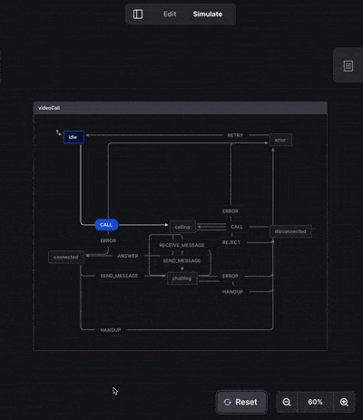

### React Tracked

`react-redux`와 함께 사용해서 자동 리렌더링 최적화를 도입할 수 있습니다. useSelector로만 리렌더링 최적화를 하기 위해서는 원시값만을 구독하거나 shallowEqual같은 상태 비교 함수(equalityFn)를 작성해야 하는 반면 위와 같이 하면 그러한 수고를 덜 수 있습니다.

```tsx
const useTrackedState = createTrackedSelector<State>(useSelector)

...

const { count } = useTrackedState()
```

```tsx
import { createTrackedSelector } from "react-tracked";
import useSelector from "./useSelector";

const useTrackedState = createTrackedSelector(useSelector);

export default useTrackedState;
```

## Redux vs Zustand

Redux를 사용하면 런타임에 스토어를 주입할 수 있다고 하는데 관련 내용이 이해가 안 되어서 좀 더 예시를 찾아보았습니다.

일반적인 Redux 스토어에서는 아래와같이 모든 reducer를 한 번에 걸합하여 정의합니다. 이때 모든 reducer를 사전에 정의해야 하므로 초기 번들 크기가 커질 수 있습니다.

```tsx
import { combineReducers, createStore } from "redux";
import userReducer from "./userReducer";
import postsReducer from "./postsReducer";

const rootReducer = combineReducers({
  users: usersReducer,
  posts: postsReducer,
});

const store = createStore(rootReducer);
```

특정 페이지에서만 필요한 리듀서를 따로 분리, [**Code Splitting**](https://redux.js.org/usage/code-splitting)을 통해 초기 번들 사이즈를 줄일 수 있습니다. 런타임에 `store.injectReducer`를 호출하여 동적으로 리듀서를 생성할 수 있습니다. 리듀서 기반으로 Code Splitting이 가능한 것을 이전에는 몰랐어서 새롭지만 그다지 사용할 거 같지는 않습니다.

```tsx
import { createStore } from "redux";

// Define the Reducers that will always be present in the application
const staticReducers = {
  users: usersReducer,
  posts: postsReducer,
};

// Configure the store
export default function configureStore(initialState) {
  const store = createStore(createReducer(), initialState);

  // Add a dictionary to keep track of the registered async reducers
  store.asyncReducers = {};

  // Create an inject reducer function
  // This function adds the async reducer, and creates a new combined reducer
  store.injectReducer = (key, asyncReducer) => {
    store.asyncReducers[key] = asyncReducer;
    store.replaceReducer(createReducer(store.asyncReducers));
  };

  // Return the modified store
  return store;
}

function createReducer(asyncReducers) {
  return combineReducers({
    ...staticReducers,
    ...asyncReducers,
  });
}
```

### Jotai vs Recoil

jotai는 atom config 객체가 key 역할을 하기 때문에 아톰생성시 별도의 key를 지정할 필요가 없습니다. 네이밍은 아주아주아주 어려운 프로그래밍 요소이므로 이를 생략할수 있다는 점은 매우 좋다고 생각합니다.

### XState

진도에서 별로 다룰 부분이 없어서 이전 장에서 잠시 소개되었던 XState 라이브러리에 대해 조금 디깅해보았습니다.

다변적으로 행동하는 복잡한 상태에 대한 상황을 다루려면 매번 flag가 하나씩 추가되어야 하는데 이때마다 관리포인트가 늘어나고 예상하지 못한 버그가 발생했던 거 같습니다. XState를 사용하면 FSM(Finite State Machine, 유한 상태 기계)모델을 통해 좀 더 예측가능하게 모델을 설계할 수 있습니다.

주요 개념

- State : 상태기계가 현재 전이된 상태(State), 상태마다 특정 이벤트를 받아서 다음 상태로 전이가 될 수 있습니다. 한 번에 한 가지 상태만 될 수 있습니다.
- Event : 상태를 전이시키는 이벤트(Event)로 상태마다 on 객체에서 이벤트를 정의할 수 있습니다.
- Transition : 상태는 이벤트에 따라 다음 상태로 전이(Transition) 됩니다.
- Context : 상태기계에서 별도로 관리하는 데이터입니다. XState에서는 전이가 일어나는 상태와 데이터를 명확하게 구분해서 사용합니다.
- Action : 컨텍스트의 값을 변경하거나 추가할 때 사용합니다.

비디오콜을 한다는 상황을 가정해서 상태머신을 작성해보았습니다. \*Context와 Action은 다루지 않습니다.

**주요 상태**

```
idle: 초기 상태.
calling: 콜 요청 중.
connected: 비디오 콜이 연결된 상태.
chatting: 연결된 상태에서 메시지를 주고받는 상태.
disconnected: 비디오 콜 종료.
error: 에러 발생.
```

**주요 이벤트**

```
CALL: 비디오 콜 요청.
ANSWER: 콜 수락.
SEND_MESSAGE: 메시지 전송.
RECEIVE_MESSAGE: 메시지 수신.
HANGUP: 콜 종료.
```

```tsx
const videoCallMachine = createMachine({
  id: "videoCall",
  initial: "idle",
  states: {
    idle: {
      on: {
        CALL: "calling",
      },
    },
    calling: {
      on: {
        ANSWER: "connected",
        REJECT: "disconnected",
        ERROR: "error",
      },
    },
    connected: {
      on: {
        SEND_MESSAGE: "chatting",
        HANGUP: "disconnected",
        ERROR: "error",
      },
    },
    chatting: {
      on: {
        SEND_MESSAGE: "chatting",
        RECEIVE_MESSAGE: "chatting",
        HANGUP: "disconnected",
        ERROR: "error",
      },
    },
    disconnected: {
      on: {
        CALL: "calling",
      },
    },
    error: {
      on: {
        RETRY: "idle",
      },
    },
  },
});
```

VSCode에서 바로 상태머신이 어떻게 동작하는지를 볼 수 있습니다.



[참고]

https://fe-developers.kakaoent.com/2022/220922-make-cart-with-xstate/
