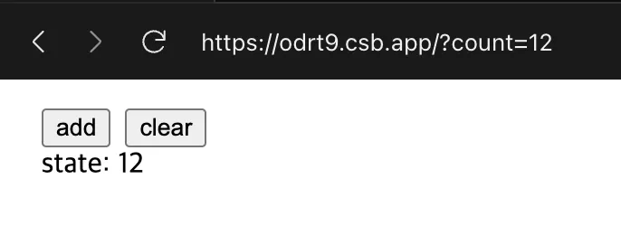

# 01. 리액트 훅과 마이크로 상태 관리

## 실습

### bailout, 값으로 상태 갱신하기, 함수로 상태 갱신하기

```tsx
"use client";

import { Button } from "@/ui/button";
import { useEffect, useState } from "react";

const init = () => {
  // 지연 초기화 함수는 컴포넌트가 마운트 될때에 1번 실행
  console.log("init");
  return 0;
};

export default function Home() {
  const [count, setCount] = useState(init);

  const bailOut = () => {
    // 리렌더링이 일어나지 않음
    console.log("bailOut");
    setCount((c) => c);
  };

  const updateWithValue = () => {
    // value로 업데이트하면 1씩 증가
    setCount(count + 1);
    setCount(count + 1);
    setCount(count + 1);
  };

  const updateWithFn = () => {
    // function으로 업데이트하면 3씩 증가
    setCount((count) => count + 1);
    setCount((count) => count + 1);
    setCount((count) => count + 1);
  };

  useEffect(() => {
    // 리렌더링 확인
    console.log("render");
    return () => {
      console.log("cleanup");
    };
  });

  return (
    <div>
      {count}
      <Button onClick={bailOut}>bailOut</Button>
      <Button onClick={updateWithValue}>Update with Value </Button>
      <Button onClick={updateWithFn}>Update with FFN (3x)</Button>
    </div>
  );
}
```

state가 원시값이 아닌 객체인 경우에도 동일할까? → 당연히 동일하게 작동합니다.

```tsx
"use client";

import { Button } from "@/ui/button";
import { useEffect, useState } from "react";

const init = () => {
  console.log("init");
  return 0;
};

export default function Home() {
  const [count, setCount] = useState({ count: 0 });

  const bailOut = () => {
    console.log("bailOut");
    setCount((c) => c);
  };

  const updateWithValue = () => {
    setCount({ count: count.count + 1 });
    setCount({ count: count.count + 1 });
    setCount({ count: count.count + 1 });
  };

  const updateWithFn = () => {
    setCount((c) => ({ count: c.count + 1 }));
    setCount((c) => ({ count: c.count + 1 }));
    setCount((c) => ({ count: c.count + 1 }));
  };

  useEffect(() => {
    console.log("render");
    return () => {
      console.log("cleanup");
    };
  });

  return (
    <div>
      {count.count}
      <Button onClick={bailOut}>bailOut</Button>
      <Button onClick={updateWithValue}>Update with Value </Button>
      <Button onClick={updateWithFn}>Update with Function (3x)</Button>
    </div>
  );
}
```

### useState를 활용한 useReducer 구현

```tsx
const [state, dispatch] = useReducer(reducer, initialArg, init?)
```

리듀서는 state와 action을 받아서 new state를 반환하는 순수함수임을 인지한다면 아래처럼 간단하게 구현해볼 수 있겠습니다.

```tsx
// 간단한 구현이므로 init은 생략
const useReducer = (reducer, initialState) => {
  const [state, setState] = useState(initialState);

  const dispatch = (action) => {
    const nextState = reducer(state, action);
    setState(nextState);
  };

  return [state, dispatch];
};
```

### 질문

p.25

책에서 차이점으로 reducer와 init을 컴포넌트 외부에서 선언하는것은 useReducer에서만 가능하다고 했는데 useState도 딱히 문제없이 작동하는데 두 개의 인라인 함수가 필요한 점을 차이점이라고 이야기하는 건가요.?

```jsx
"use client";

import { useState } from "react";

const init = () => 0;
const reducer = (state, action) => {
  switch (action.type) {
    case "increment":
      return state + 1;
    default:
      return state;
  }
};

const Page = () => {
  // init, reducer가 외부에 있지만 문제없이 잘 작동합니다;
  const [count, setCount] = useState(init);
  const dispatch = (action) => setCount((state) => reducer(state, action));
  return (
    <div>
      <h1>{count}</h1>
      <button
        onClick={() =>
          dispatch({
            type: "increment",
          })
        }
      >
        Increment
      </button>
    </div>
  );
};

export default Page;
```

## useState를 활용한 상태관리 유틸 훅 찾아보기 및 소개

상태관리를 위해 라이브러리들에서 제공하는 유틸 훅들을 조금 찾아보고 구현부도 한 번 찾아보았습니다.

\*아래 두 라이브러리를 위주로 찾아보았습니다.

- [react-use](https://github.com/streamich/react-use)
- [ahooks](https://github.com/alibaba/hooks)

### useSetState

- 기존상태를 유지하면서 특정 키만 부분 업데이트(patch)할 수 있는 유틸을 제공합니다.
- 객체 형태의 상태를 관리할때 short-cut으로 사용하기 편리해보입니다.
- 이전에 class compontnent의 `this.setState`와 유사하다고 합니다.

```tsx
import { useCallback, useState } from "react";

const useSetState = <T extends object>(
  initialState: T = {} as T
): [T, (patch: Partial<T> | ((prevState: T) => Partial<T>)) => void] => {
  const [state, set] = useState<T>(initialState);
  const setState = useCallback(
    (patch: Partial<T> | ((prevState: T) => Partial<T>)) => {
      set((prevState) => ({
        ...prevState,
        ...(patch instanceof Function ? patch(prevState) : patch),
      }));
    },
    []
  );

  return [state, setState];
};

export default useSetState;
```

사용예시

```tsx
import useSetState from "./useSetState";

const ExampleComponent = () => {
  const [state, setState] = useSetState({ count: 0, text: "" });

  const increment = () => setState({ count: state.count + 1 });
  const updateText = () => setState({ text: "Hello, world!" });

  return (
    <div>
      <p>Count: {state.count}</p>
      <p>Text: {state.text}</p>
      <button onClick={increment}>Increment</button>
      <button onClick={updateText}>Update Text</button>
    </div>
  );
};
```

https://github.com/streamich/react-use/blob/master/src/useSetState.ts

### useDefault

- 상태 값이 undefined나 null일 경우 기본값(defaultValue)을 반환합니다.
- 사용자가 null-safe 상태 관리를 원하거나 기본값 적용 로직을 단순화하고 싶을 때 적합합니다.

```tsx
import { useState } from "react";

const useDefault = <TStateType,>(
  defaultValue: TStateType,
  initialValue: TStateType | (() => TStateType)
) => {
  const [value, setValue] = useState<TStateType | undefined | null>(
    initialValue
  );

  if (value === undefined || value === null) {
    return [defaultValue, setValue] as const; // as const를 붙여야 배열이 아닌 튜플로 반환 할 수 있습니다.
  }

  return [value, setValue] as const;
};

export default useDefault;
```

\*배열을 반환하는 경우 `as const`를 붙이면 일반적인 배열(Array)이 아니라 읽기 전용 튜플로 타입이 추론되어서 안정성이 보장됩니다.
https://github.com/streamich/react-use/blob/master/src/useDefault.ts

### useGetState

- 최신 상태를 동기적으로 안전하게 반환하는 `getState` 매서드를 제공합니다. 내부적으로 useRef를 사용해서 최신 상태 참조를 기억하기 때문에 항상 최신상태를 안전하게 반환할 수 있습니다.

```tsx
import type { Dispatch, SetStateAction } from "react";
import { useState, useCallback } from "react";
import useLatest from "../useLatest";

type GetStateAction<S> = () => S;

function useGetState<S>(
  initialState: S | (() => S)
): [S, Dispatch<SetStateAction<S>>, GetStateAction<S>];
function useGetState<S = undefined>(): [
  S | undefined,
  Dispatch<SetStateAction<S | undefined>>,
  GetStateAction<S | undefined>
];
function useGetState<S>(initialState?: S) {
  const [state, setState] = useState(initialState);
  const stateRef = useLatest(state);

  const getState = useCallback(() => stateRef.current, []);

  return [state, setState, getState];
}

export default useGetState;
```

```tsx
import { useRef } from "react";

function useLatest<T>(value: T) {
  const ref = useRef(value);
  ref.current = value;

  return ref;
}

export default useLatest;
```

https://ahooks.js.org/hooks/use-get-state

\*아래부터는 구현부는 제외하고 API와 사용예시 위주로 소개

### useResetState

useState에 추가적으로 reset 매서드를 제공합니다.

```tsx
const [state, setState, resetState] = useResetState<S>(
  initialState: S | (() => S),
): [S, Dispatch<SetStateAction<S>>, () => void]
```

### usePrevious

이전 state를 추적하는 훅입니다.

```tsx
const previousState: T = usePrevious<T>(
  state: T,
  shouldUpdate?: (prev: T | undefined, next: T) => boolean
);
```

```tsx
export default () => {
  const [count, setCount] = useState(0);
  const previous = usePrevious(count);
  return (
    <>
      <div>counter current value: {count}</div>
      <div style={{ marginBottom: 8 }}>counter previous value: {previous}</div>
      <button type="button" onClick={() => setCount((c) => c + 1)}>
        increase
      </button>
      <button
        type="button"
        style={{ marginLeft: 8 }}
        onClick={() => setCount((c) => c - 1)}
      >
        decrease
      </button>
    </>
  );
};
```

https://ahooks.js.org/hooks/use-previous

### useUrlState

URL은 훌륭한 전역 상태 관리 도구입니다.

```tsx
import useUrlState from "@ahooksjs/use-url-state";

const [state, setState] = useUrlState({ demoCount: "1" });
```


https://github.com/alibaba/hooks/tree/master/packages/use-url-state

### useMap, useSet

Map, Set 자료구조의 상태관리를 제공합니다.

```tsx
const [map, { set, setAll, remove, reset, get }] = useMap<K, V>(initialValue);
```

```tsx
const [set, { add, remove, reset }] = useSet<K>(initialValue);
```
