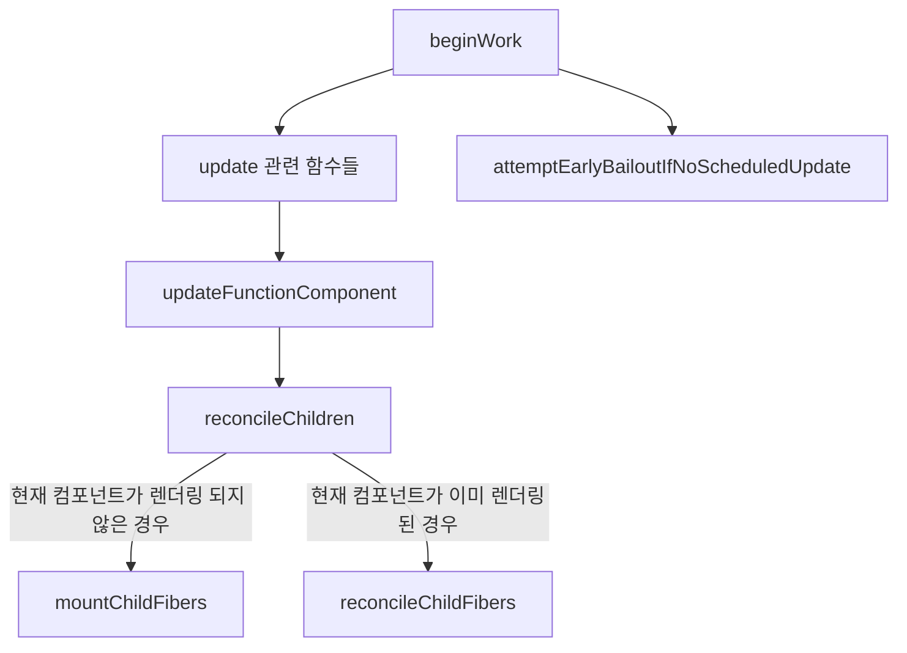

# 1주차 리액트 훅과 마이크로 상태 관리

## 마이크로 상태관리란?

- hook의 등장으로 마이크로 상태관 리가 가능하게 되었다.
  - 초기 리액트의 기조에 맞게 재사용 가능한 UI를 만들고 효율적으로 업데이트하기 위해 등장했다.
  - hook과 더불어 fiber 개념이 등장했고 함수형으로도 상태 관리가 가능해졌다
- 마이크로 상태 관리는 **범용적이고 가볍고 사용자의 적절한 선택을 통한 상태 관리**이다
  - 로컬 스코프에서 관리 가능한 상태를 말하며 특정 컴포넌트에 독립적으로 존재하는 데이터이다.
  - 외부에서도 해당 값을 접근할 수는 없다. 부모, 자식간의 props로 주고 받고 있거나, 전역으로 관리하고 있지 않는 한 말이다.

책을 읽다가 동시성 렌더링에 더 알아보고 싶어서 간단하게 정리해보았다

🚨 틀린 부분있으면 피드백 부탁드립니다.

## 리액트의 동시성(concurrency)

기본적으로 프로그래밍에서 말하는 동시성이란 **여러 작업이 동시에 실행되고 있는 것 처럼 구현되는 것**이라고 한다.
싱글 코어에서 멀티 스레드 환경을 구축하여 빠른 `switching`을 통해 작업 처리하는 것을 말한다.

그러면 리액트에서 말하고자 하는 [동시성(concurrency)](https://ko.react.dev/blog/2022/03/29/react-v18#what-is-concurrent-react)은 어떻게 적용하고자 했을까?
일단 동시성의 개념은 18버전에서 부터 등장했고 이로 인해 automatic batching, suspense 등 여러 기능들이 탄생했다.

리액트의 동시성은 **렌더링을 더 효율적으로 효과적으로 수행하기 위해 적용한 기술**이다.
핵심은 **렌더링을 중단할 수 있다는 것**이다. 즉, 렌더링을 컨트롤할 수 있다는 것이다.
렌더링이 시작되고 도중에 잠시 멈출 수도 있으며 이후 이어가거나 완전한 중단도 가능하다.

### react-reconciler

- 아래는 간단하게 react-reconciler의 로직을 토대로 작성한 플로우이다.
- 여기서는 functional 컴포넌트에 대해서 딱 업데이트까지의 과정을 간력하게 그려놓았다.
- Fiber들의 `beginWork` 반복된 호출을 통해 업데이트 사항을 수집하고 한번에 반영한다.
- 베일아웃하는 과정도 포함되어 있다.

🔍 React에서도 동일한 플로우를 따르고 있을까요??



#### update 관련된 함수들

- 다양한 tag들이 있으며 tag 값에 따라 호출하는 update 함수들이 다르다.

#### reconcileChildren

- 이 단계에서 fiber의 이전 props(`current.memoizedProps`)와 새로운 props(`workInProgress.pendingProp`)를 비교하는 작업이다.
- 세부 구현사항은 [ReactChildFiber.js](https://github.com/facebook/react/blob/main/packages/react-reconciler/src/ReactChildFiber.js) 에서 확인 가능하다.
- [shallowEqual](https://github.com/facebook/react/blob/main/packages/shared/shallowEqual.js)를 통해 비교히지 않나..

```ts
// 현재 컴포넌트가 이미 렌더링된 경우
export const reconcileChildFibers: ChildReconciler =
  createChildReconciler(true);
// 현재 컴포넌트가 렌더링 되지 않은 경우
export const mountChildFibers: ChildReconciler = createChildReconciler(false);

// 자식 삭제, 생성. 업데이트 등... 렌더링 최적화를 위한 작업 수행
```

## useState 사용하기

- state를 갱신하는 방법

```jsx
const Component = () => {
  const [count, setCount] = useState(0);

  // 1-1. 값으로 갱신하기
  const handleClick = () => {
    setCount(1);
    // click by once = 1, 1, 1
  };

  // 1-2. 값으로 갱신하기
  const handleClick = () => {
    setCount(count + 1);
    setCount(count + 1);
    setCount(count + 1);
    // click by once = 1, 2, 3
  };

  // 2. 엡데이트 함수로 갱신하기
  const handleClick = () => {
    setCount((prev) => prev + 1);
    setCount((prev) => prev + 1);
    setCount((prev) => prev + 1);
    // click by once = 3, 6, 9
  };

  return (
    <div>
      {count}
      <button onClick={handleClick}>click</button>
    </div>
  );
};
```

- 값을 업데이트 하는 시점에 직전 값과 정확히 같다면 **렌더링 되지 않는데** 이를 **베일아웃**이라고 한다.
- 이유는 리액트에서는 얕은 비교를 하고 있기에 여기서 같다고 판단하면 리렌더링하지 않는다.
- 위에서 언급한 `shallowEqual`에서 `Object.is`를 통해 비교

### 동등 비교표

| x                 | y                 | ==       | ===      | Object.is | SameValueZero |
| ----------------- | ----------------- | -------- | -------- | --------- | ------------- |
| undefined         | undefined         | **true** | **true** | **true**  | **true**      |
| null              | null              | **true** | **true** | **true**  | **true**      |
| true              | true              | **true** | **true** | **true**  | **true**      |
| false             | false             | **true** | **true** | **true**  | **true**      |
| 'foo'             | 'foo'             | **true** | **true** | **true**  | **true**      |
| 0                 | 0                 | **true** | **true** | **true**  | **true**      |
| +0                | -0                | **true** | **true** | false     | **true**      |
| +0                | 0                 | **true** | **true** | **true**  | **true**      |
| -0                | 0                 | **true** | **true** | false     | **true**      |
| 0n                | -0n               | **true** | **true** | **true**  | **true**      |
| 0                 | false             | **true** | false    | false     | false         |
| ""                | false             | **true** | false    | false     | false         |
| ""                | 0                 | **true** | false    | false     | false         |
| '0'               | 0                 | **true** | false    | false     | false         |
| '17'              | 17                | **true** | false    | false     | false         |
| [1, 2]            | '1,2'             | **true** | false    | false     | false         |
| new String('foo') | 'foo'             | **true** | false    | false     | false         |
| null              | undefined         | **true** | false    | false     | false         |
| null              | false             | false    | false    | false     | false         |
| undefined         | false             | false    | false    | false     | false         |
| { foo: 'bar' }    | { foo: 'bar' }    | false    | false    | false     | false         |
| new String('foo') | new String('foo') | false    | false    | false     | false         |
| 0                 | null              | false    | false    | false     | false         |
| 0                 | NaN               | false    | false    | false     | false         |
| 'foo'             | NaN               | false    | false    | false     | false         |
| NaN               | NaN               | false    | false    | **true**  | **true**      |

## useReducer 사용하기

```jsx
const reducer = (state, action) => {
  switch (action.type) {
    case "INCREMENT":
      return { ...state, count: state.count + 1 };
    case "SET_TEXT":
      return { ...state, text: action.text };
    default:
      throw new Error("알 수 없는 action type");
  }
};

const Component = () => {
  const [state, dispatch] = useReducer(reducer, { count: 0, text: "hi" });

  const incrementCount = () => {
    dispatch({ type: "INCREMENT" });
  };

  const handleChangeText = (e) => {
    dispatch({ type: "SET_TEXT", text: e.target.value });
  };

  useEffect(() => {
    console.log("render!");
  });

  return (
    <div>
      <p>{`count ${state.count}`}</p>
      <button onClick={incrementCount}>Increment count</button>
      <input value={state.text} onChange={handleChangeText} />
    </div>
  );
};
```

- 많은 state를 관리해야하고 명확한 action들이 많을 때 유용하다.
- reducer를 단일 함수로 분리 가능하기에 테스트에 유용하다.

- 여기서도 베일아웃이 되는 것을 확인할 수 있다.
- 지금 코드에서는 action을 취할 때마다 `render!`가 로그에 찍힌다
- `reducer`에서 스프레드 연산자로 무언가를 반환하는 것이 아닌 이전의 `state` 그대로 반환하는 코드로 바꾼다면 `render!`가 찍히지 않는 것을 확인할 수 있다.

## useState와 useReducer 만들기

### useReducer로 useState 구현하기

```jsx
import { useReducer } from "react";

const reducer = (prev, action) =>
  typeof action === "function" ? action(prev) : action;

export default function Component() {
  const useState = (initValues) => useReducer(reducer, initValues);
  const [count, setCount] = useState(0);

  return (
    <div>
      <p>{count}</p>
      <button onClick={() => setCount((p) => p + 1)}> up</button>
    </div>
  );
}
```

1. 간단하게 보면 `setCount`로 넘긴 인자는 `function` 타입이기에 `action(prev)`가 실행
2. 그렇다면 `initValues`로 넘긴 `0`이 `prev`이고 이렇게 되면 `0 + 1`로 계산하여 `count`는 1로 반환

### useState로 useReducer 구현하기

```jsx
import { useCallback, useState } from "react";

const useReducer = (reducer, initialArg, init) => {
  const [state, setState] = useState(
    init ? () => init(initialArg) : initialArg
  );

  const dispatch = useCallback(
    (action) => setState((prev) => reducer(prev, action)),
    [reducer]
  );

  return [state, dispatch];
};

const reducer = (state, action) => {
  switch (action.type) {
    case "INCREMENT":
      return { ...state, count: state.count + 1 };
    default:
      throw new Error("알 수 없는 action type");
  }
};

export default function Component() {
  const [state, dispatch] = useReducer(reducer, { count: 0 });

  const incrementCount = () => {
    dispatch({ type: "INCREMENT" });
  };

  return (
    <div>
      <p>{`count ${state.count}`}</p>
      <button onClick={incrementCount}>Increment count</button>
    </div>
  );
}
```

1. `dispatch`에 `{ type: "INCREMENT" }` 전달하면 `reducer`로 `action`이 전달된다.
2. 이후 `useReducer`에서 정의한 `prev state`가 `state`로 전달이 된다.
3. 마지막으로 `switch`문에서 맞는 `action.type`을 찾고 올바른 로직을 수행

## 참고

- [동시성(concurrency) & 병렬성(parallelism)](https://velog.io/@leesomyoung/%EB%8F%99%EC%8B%9C%EC%84%B1concurrency-%EB%B3%91%EB%A0%AC%EC%84%B1parallelism)
- [React의 Concurrent이란?](https://ko.react.dev/blog/2022/03/29/react-v18#what-is-concurrent-react)
- [동등 비교 및 동일성](https://developer.mozilla.org/ko/docs/Web/JavaScript/Equality_comparisons_and_sameness)
