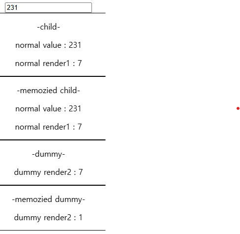

# 03. 리액트 컨텍스트를 이용한 컴포넌트 상태 공유

상태 관리를 위해 탄생한 것이 아닌 상태를 주입하고 공유하는 용도

관리를 위해서는 별도의 처리가 필요

---

## 컨텍스트 이해하기

앞서 보여줬던 예제로 context를 다뤄보겠다.

```jsx
const TextContext = createContext("test");

const ParentComponent = () => {
  return (
    <div>
      <ChildComponent1 />     
      <TextContext.Provider value="provider value">
        <ChildComponent2 />     
      </TextContext.Provider>
       
    </div>
  );
};

const ChildComponent1 = () => {
  const textValue = useContext(TextContext);

  return (
    <div>
      <input value={textValue} />
    </div>
  );
};

const ChildComponent2 = () => {
  const textValue = useContext(TextContext);

  return (
    <div>
      <input value={textValue} />
    </div>
  );
};
```

Provider를 통해 제공되는 값이 없으면 기본값을 사용하고
Provider가 있을 경우 가장 가까운 값을 사용한다.
ChildComponent1 -> text
ChildComponent1 -> provider value

---

useState를 이용해 상태와 handler를 만들고 Provider에 주입한다.

이후 필요한 컴포넌트에서 context를 불러와 주입한 state와 handler를 그대로 쓰면된다.

ChildComponent들은 실제로 context가 어떤 구조로 이루어져있는지는 모르지만 제공된 상태들을 사용할 수 있다.

```jsx
const TextContext = createContext({
  value: "",

  onChangeText: () => {},
});

const ParentComponent = () => {
  const [text, setText] = useState("");

  const handleTextValue = (e) => {
    setText(e.target.value);
  };

  return (
    <TextContext.Provider
      value={{ value: text, onChangeText: handleTextValue }}
    >
      <ChildComponent1 />
      <ChildComponent2 /> 
    </TextContext.Provider>
  );
};

const ChildComponent1 = () => {
  const { value, onChangeText } = useContext(TextContext);

  return (
    <div>
      <input value={value} onChange={onChangeText} />
    </div>
  );
};

const ChildComponent2 = () => {
  const { value, onChangeText } = useContext(TextContext);

  return (
    <div>
      <input value={value} onChange={onChangeText} />
    </div>
  );
};
```

컨텍스트는 제공된 공급자가 있다면 이로 인해 컨텍스트 값을 변경할 수 있다.
컨텍스트가 변경되면 consumer들은 모두 리렌더링 된다.

컨텍스트의 변경이 없는데도 리렌더링이 일어난다면 해결책은 두 가지이다

1. 이전에 배웠던 lifting content up
2. memo를 이용한 메모이제이션

memo로 감싸진 컴포넌트(memoized component)의 props가 변경되지 않는다면 일반적으로 부모가 리렌더링 되어도 리렌더링 되지 않는다.

이전에 리액트의 업데이트 과정 중 memoized라는 단어가 심심치 않게 나온다.
비교/수집 과정에서 props에 대한 부분도 하고 있다는 뜻

[memo](https://ko.react.dev/reference/react/memo)

문서를 확인하면 DEEP DIVE 파트에 항상 memo가 되어야 하는지에 대한 내용이 있다.

---

컨텍스트와 연관된 consumer가 리렌더링되는 이유

- 컨텍스트의 상태가 변경 되어서
- 부모의 상태가 변경 되어서

렌더링만 표기하기 위한 dummy와 렌더링 체크를 위해

1. 최상단에서 렌더를 유발하는 작업을 실시
2. 동시에 변경된 값을 provider의 주입

이로써 위에서 말한 리렌더링되는 이유를 모두 살펴볼 수 있다.

```jsx
export const ContextComponent = () => {
  const [text, setText] = useState("");

  const handleTextValue = (e) => {
    setText(e.target.value);
  };

  return (
    <div>
      <TextContext.Provider value={{ value: text }}>
        <input value={text} onChange={handleTextValue} />
        <ParentComponent />
      </TextContext.Provider>
    </div>
  );
};

const TextContext = createContext({
  value: "",
});

const ParentComponent = () => {
  return (
    <div>
      <div style={{ border: "1px solid black" }}>
        <p>-child-</p>
        <ChildComponent />
      </div>
      <div style={{ border: "1px solid black" }}>
        <p>-memoized child-</p>
        <MemoizedChildComponent />
      </div>
      <div style={{ border: "1px solid black" }}>
        <p>-dummy-</p>
        <DummyComponent />
      </div>
      <div style={{ border: "1px solid black" }}>
        <p>-memoized dummy-</p>
        <MemoizedDummyComponent />   
      </div> 
    </div>
  );
};

// ==================================================================

const ChildComponent = () => {
  const { value } = useContext(TextContext);

  const renderRef = useRef(1);

  useEffect(() => {
    renderRef.current += 1;
  });

  return (
    <div>
      <p>normal value : {value}</p>
      <p>normal render1 : {renderRef.current}</p>
    </div>
  );
};

const MemoizedChildComponent = memo(ChildComponent);

// ==================================================================

const DummyComponent = () => {
  const renderRef = useRef(1);

  useEffect(() => {
    renderRef.current += 1;
  });

  return (
    <div>
      <p>dummy render2 : {renderRef.current}</p>
    </div>
  );
};

const MemoizedDummyComponent = memo(DummyComponent);
```

- **결과**



---

## 컨텍스트에 객체를 사용했을 때의 한계점

**리렌더링 원인**

- handler가 호출되면 값이 변경되면서 ContextComponent가 리렌더링
- 이로인해 provider의 컨텍스트 값도 변경되면서 ParentComponent도 리렌더링

1. child -> 부모의 상태 변경 + 컨텍스트의 변경
2. memoized child -> 컨텍스트의 변경
3. dummy -> 부모의 상태 변경
4. memoized dummy -> 리렌더링 X

---

객체를 값으로 하는 컨텍스트의 경우
memoized된 컴포넌트에 서로 다른 객체의 일부 값을 넣어도 한 쪽에서 렌더링이 일어나면 다른 쪽도 영향을 받는다.

이런 한계를 극복하기 위해서는 다음과 같은 작업이 필요하다.

1. 상태 쪼개기
2. useReducer로 하나의 상태로 여러 컨텍스트로 전파하기

**상태 쪼개기**

```jsx
export const ParentComponent = () => {
  return (
    <div>
            <Text1 />
            <Text2 />   {" "}
    </div>
  );
};

const Text1 = () => {
  const [text, setText] = useContext(TextContext1);
  return (
    <div>
      <input
        type="text"
        value={text}
        onChange={(e) => setText(e.target.value)}
      />
    </div>
  );
};

const Text2 = () => {
  const [text, setText] = useContext(TextContext2);

  return (
    <div>
      <input
        type="text"
        value={text}
        onChange={(e) => setText(e.target.value)}
      />
    </div>
  );
};
```

각각 Text1과 Text2 컴포넌트는 서로 다른 컨텍스트를 가지고 있으며 이는 독립적이다.

그런 다음 각 컨텍스트에 대한 provider를 만든다

```jsx
const Text1Provider = ({ children }) => {
  const state = useState("");

  return (
    <TextContext1.Provider value={state}>{children}</TextContext1.Provider>
  );
};

const Text2Provider = ({ children }) => {
  const state = useState("");

  return (
    <TextContext2.Provider value={state}>{children}</TextContext2.Provider>
  );

  // 이후 감싸주기만하면 끝!

  export const ParentComponent = () => {
    return (
      <div>
        <Text1Provider>
          <Text2Provider>
            <Text1 />
            <Text2 /> 
          </Text2Provider>
        </Text1Provider>
      </div>
    );
  };
};
```

**useReducer로 하나의 상태로 여러 컨텍스트로 전파하기**

```jsx
const Provider = ({ children }) => {
  const [state, dispatch] = useReducer(
    (prev, action) => {
      switch (action.type) {
        case "INC1":
          return { ...prev, count1: prev.count1 + 1 };
        case "INC2":
          return { ...prev, count2: prev.count1 + 1 };
      }
    },
    {
      count1: 0,
      count2: 0,
    }
  );

  return (
    <DispatchContext.Provider value={dispatch}>
      <Count1Context.Provider value={state.count1}>
        <Count2Context.Provider value={state.count2}>
          {children}
        </Count2Context.Provider>
      </Count1Context.Provider>
    </DispatchContext.Provider>
  );
};
// 필요한 곳에서 사용
const Component1 = () => {
  const count = useContext(Count1Context);

  const dispatch = useContext(DispatchContext);

  return (
    <div>
      count1 : {count}
      <button onClick={() => dispatch({ type: "INC1" })}>inc</button>
    </div>
  );
};
```

상태는 여러 개로 두면서 action은 dispatch하나로 관리한다.

이렇게 되면 상태가 변경된 컴포넌트만 리렌더링 된다.

---

## 컨텍스트 사용을 위한 모범 사례

**1. 사용자 정의 훅과 공급자 컴포넌트 만들기**

별도 커스텀 훅을 통해 해당 context provider내에서만 useContext를 쓸 수 있도록 할 수 있다.

```jsx
const TextContext = createContext(null);

export const TextProvider = ({ children }) => (
  <TextContext.Provider value={useState("")}>{children}</TextContext.Provider>
);

export const useText = () => {
  const value = useContext(TextContext);

  if (value === null)
    throw new Error("useText는 TextContext 내에서만 사용할 수 있습니다.");

  return value;
};
```

이렇게 되면 useText를 사용하는 컴포넌트는 컨텍스트를 몰라도 사용할 수 있다.

**2. 사용자 정의 훅이 있는 팩토리 패턴**

- 팩토리 패턴은 생각지도 못했다...
- 반복적인 작업을 줄여줄 수 있다.

```jsx
const createStateContext = (useValue) => {
  const StateContext = createContext(null);
  const StateProvider = ({ initialValue, children }) => (
    <StateContext.Provider value={useValue(initialValue)}>
      {children}
    </StateContext.Provider>
  );

  // ====================================

  const useContextState = () => {
    const value = useContext(StateContext);
    if (value === null)
      throw new Error("해당 훅은 Provider내에서만 사용할 수 있습니다.");
    return value;
  };

  return [StateProvider, useContextState];
};
```

- 사용할 떄는 아래와 같이 쓴다

```jsx
// =============== 실제로 사용할 때 - 양산 가능=====================
const useTextState = (init) => useState(init || "");
const [Text1Provider, useText1] = createStateContext(useTextState);
const [Text2Provider, useText2] = createStateContext(useTextState);
```

**3. reduceRight를 이용한 공급자 중첩 방지**

- 실제로 쓰고 있는 사례를 들고 왔다.

```tsx
import { NotificationProvider, ThemeProvider, UserProvider } from "./providers";

type AppProviderProps = {
  children: React.ReactNode;
};

const providers = [ThemeProvider, UserProvider, NotificationProvider];

export function AppProvider({ children }: AppProviderProps) {
  return providers.reduceRight((acc, Provider) => {
    return <Provider>{acc}</Provider>;
  }, children);
}
```

- 책과 다른 접이라면 나는 JSX 문법으로 바로 Provider를 중첩시켜 좀 더 익숙한 방식을 택했다
- 하지만 props를 전달하지 않는다는 점..
- 이는 1번처럼 커스텀훅으로 다 대체하고 있어서 props로 전달할 생각을 못함
- 성능상의 차이는 미비하지 않을까..
