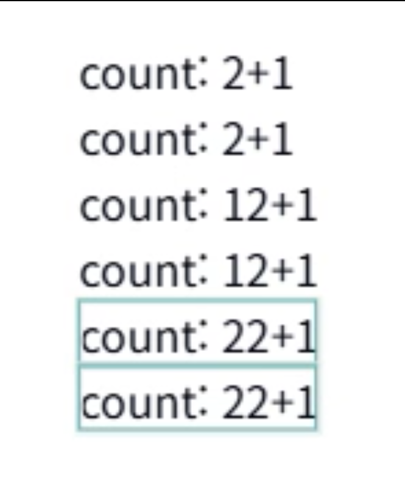

# 05. 리액트 컨텍스트와 구독을 이용한 컴포넌트 상태 공유

컨텍스트 + 구독 조합의 이점

- 리렌더링 최적화 + 원하는 컴포넌트에 서로 다른 상태를 공급

## 모듈 상태의 한계

- 리액트 외부에 두는 싱글톤 기반이라 각 컴포넌트에 다른 상태를 줄 수 없음
- 만약 리액트 외부에 특정 상태를 가지는 store가 있다면
- 리액트에서는 해당 store를 다루는 hook이 필요함 (useStore)
- 각 컴포넌트에 다른 값을 주고 싶으면 또 하나의 store를 만들어야함
- 재사용성 측면을 생각했을 때 컴포넌트는 가능하지만 모듈은 불가능하다.

## 컨텍스트 사용이 필요한 시점

- 전체 컴포넌트 트리의 하위 트리에 대해 다른 값을 제공할 필요가 있다면 Provider를 사용
- 하나의 컨텍스트를 쓰는 경우는 모듈이 대체가 가능하니 이유를 찾자면 서로 다른 하위 트리에 서로 다른 값을 제공해야 하는 경우 사용

## 컨텍스트의 구독 패턴

- 서로의 단점을 커버하기 위한 패턴
- 모듈과는 다르게 컨텍스트를 활용한 업데이트 방법을 제공
- `useSubscription` 대신 `useSyncExternalStore`를 사용하여 재구현
- 큰 변화는 없지만 다만 selector를 별도로 구현을 안해도 된다
- 이렇게 되면 Provider의 중첩이 발생해도 해당 context를 사용하고 있는 컴포넌트는 가장 가까운 Provider의 값을 사용하게 된다

```tsx
type State = { count: number; text?: string };

const StoreContext = createContext<Store<State>>(createStore({ count: 0 }));

const StoreProvider = ({
  initialState,
  children,
}: {
  initialState: State;
  children: ReactNode;
}) => {
  const storeRef = useRef<Store<State>>();
  if (!storeRef.current) {
    storeRef.current = createStore(initialState);
  }
  return (
    <StoreContext.Provider value={storeRef.current}>
      {children}
    </StoreContext.Provider>
  );
};

// =========================================================

const useStore = () => {
  const store = useContext(StoreContext);
  return useSyncExternalStore(store.subscribe, store.getState);
};

// =========================================================

const useSetState = () => {
  const store = useContext(StoreContext);
  return store.setState;
};

// =========================================================

const Component = () => {
  const state = useStore();
  const setState = useSetState();

  const inc = () => {
    setState((prev) => ({
      ...prev,
      count: prev.count + 1,
    }));
  };

  return (
    <div>
      count: {state.count}
      <button onClick={inc}>+1</button>
    </div>
  );
};

// =========================================================

export default function App() {
  return (
    <div>
      <Component />
      <Component />
      <StoreProvider initialState={{ count: 10 }}>
        <Component />
        <Component />
        <StoreProvider initialState={{ count: 20 }}>
          <Component />
          <Component />
        </StoreProvider>
      </StoreProvider>
    </div>
  );
}
```

### 결과

- render1
  ;
- render2
  ;
- render3
  ;
